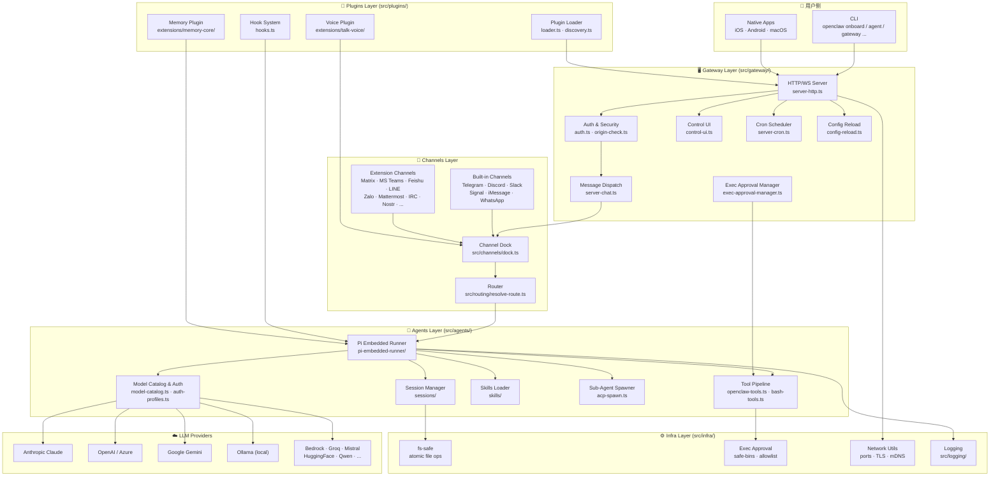
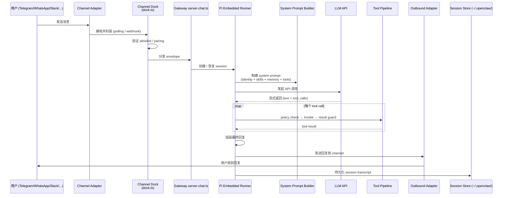
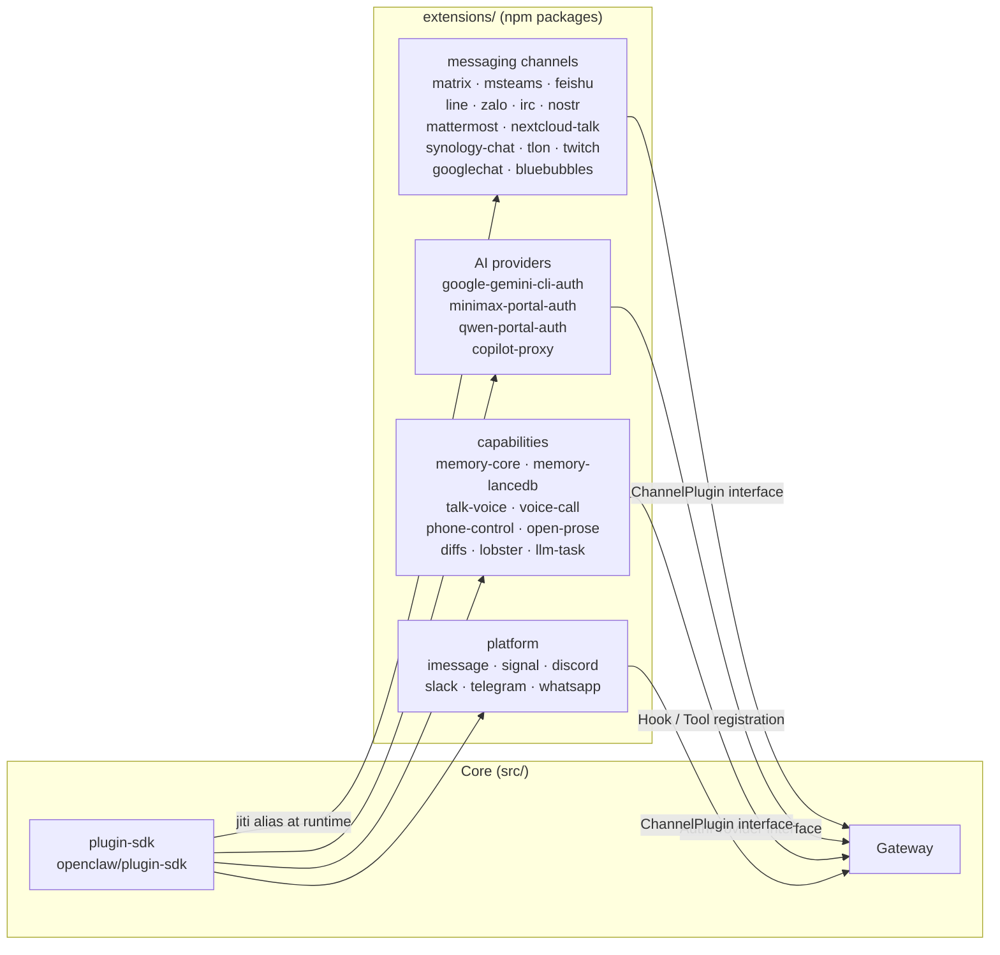
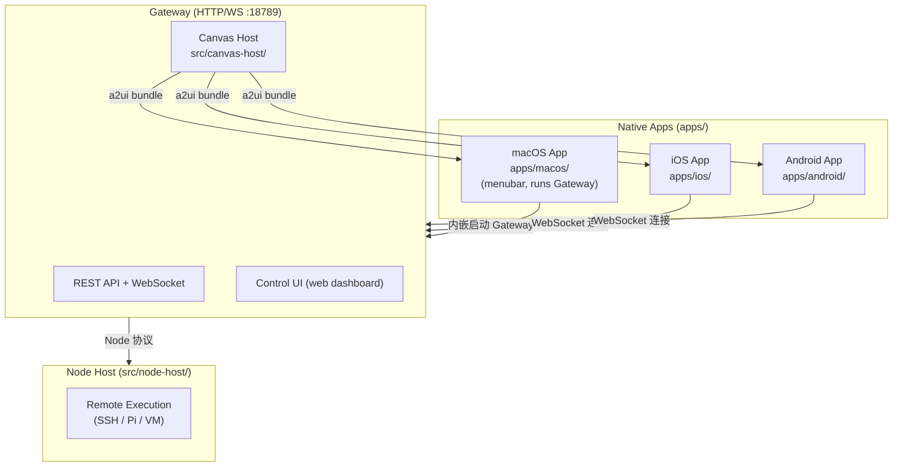
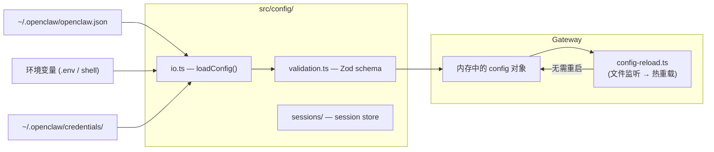
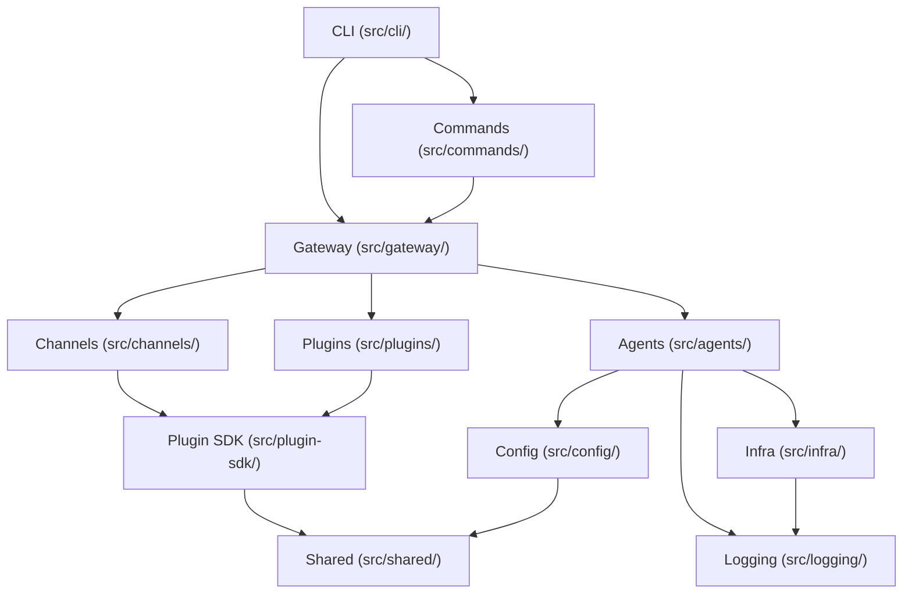

# 11 — Architecture Diagrams

**Source files**: `src/gateway/server.impl.ts`, `src/agents/pi-embedded-runner/`, `src/channels/`, `src/plugins/`, `src/cli/`, `extensions/`

> 本文档以 Mermaid 图表形式直观呈现 OpenClaw 的整体架构、消息流、模块依赖和扩展体系。文字版说明请参阅 [02 — Overall Architecture](./02-overall-architecture.md)。

---

## 1. 整体分层架构图

---

## 2. 消息处理完整数据流

---

## 3. 扩展体系（Extensions）

---

## 4. 原生 App 与 Gateway 的关系

---

## 5. 配置与密钥流

---

## 6. 模块依赖关系（简化）

---

## 7. 关键文件速查

| 层次 | 文件 | 职责 |
|------|------|------|
| **CLI** | `src/entry.ts` | 进程启动、respawn guard |
| **CLI** | `src/cli/program.ts` | Commander 程序构建器 |
| **CLI** | `src/cli/deps.ts` | `createDefaultDeps()` DI 工厂 |
| **Gateway** | `src/gateway/server.impl.ts` | 主服务器实现 |
| **Gateway** | `src/gateway/server-chat.ts` | 消息 → Agent 分发 |
| **Gateway** | `src/gateway/server-channels.ts` | Channel 生命周期管理 |
| **Gateway** | `src/gateway/config-reload.ts` | 热重载配置 |
| **Agents** | `src/agents/pi-embedded-runner/pi-embedded-runner.ts` | LLM session 主循环 |
| **Agents** | `src/agents/openclaw-tools.ts` | 内置工具注册 |
| **Agents** | `src/agents/model-catalog.ts` | 模型目录与选择 |
| **Channels** | `src/channels/dock.ts` | Channel 消息入口 |
| **Channels** | `src/routing/resolve-route.ts` | 消息路由解析 |
| **Plugins** | `src/plugins/loader.ts` | 插件发现与加载 |
| **Plugins** | `src/plugins/hooks.ts` | Hook 系统 |
| **Infra** | `src/infra/` | exec 审批、fs-safe、端口、心跳 |
