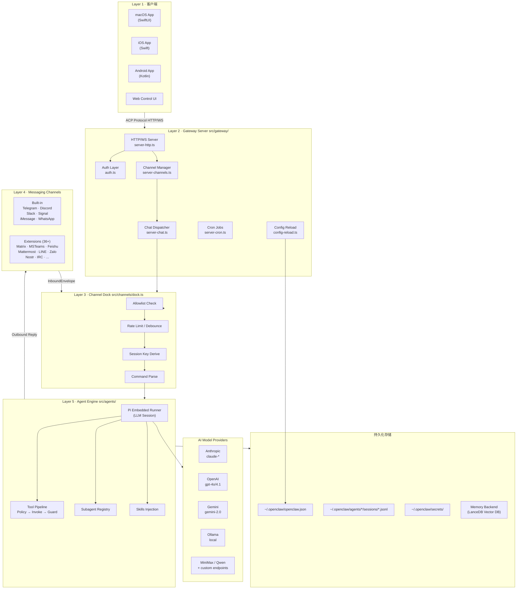
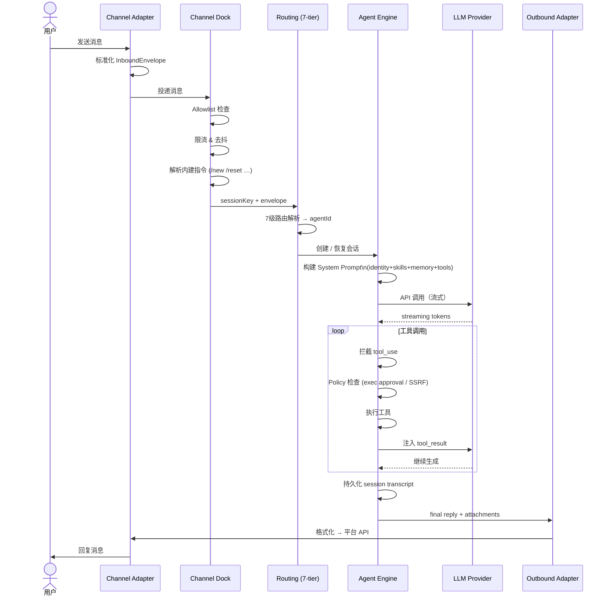
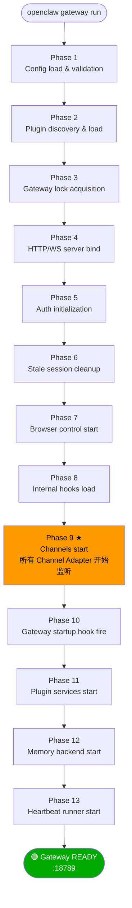
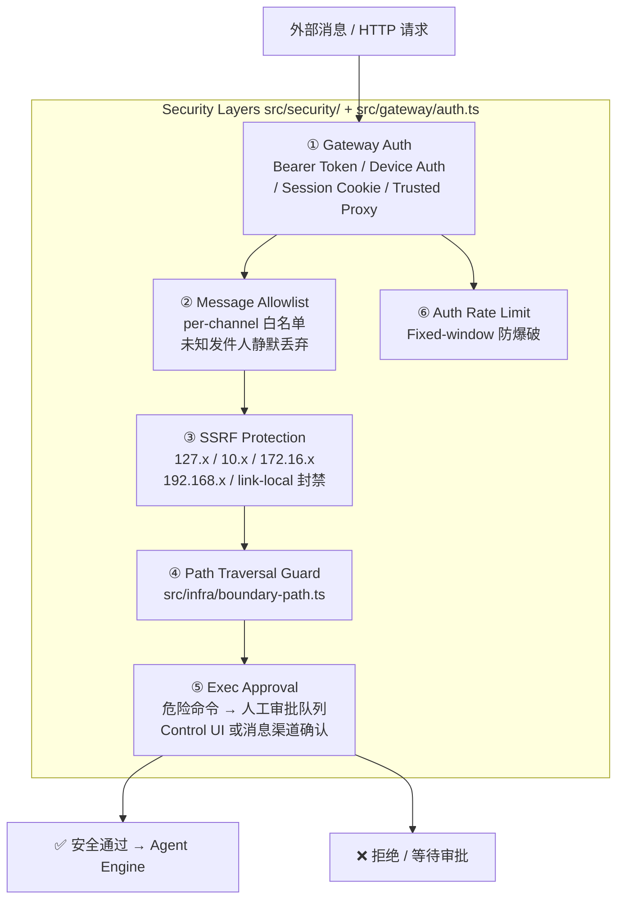

# 16 — 技术架构图（Technical Architecture Diagram）

**Source files**: `src/entry.ts`, `src/gateway/server.impl.ts`, `src/channels/dock.ts`, `src/agents/`, `src/plugins/`, `src/plugin-sdk/`

---

## 1. 整体分层架构

```
┌─────────────────────────────────────────────────────────────────────────────┐
│                           OpenClaw Platform                                 │
│  Version: 2026.3.x   Runtime: Node 22+ / Bun   Language: TypeScript (ESM)  │
└─────────────────────────────────────────────────────────────────────────────┘

╔══════════════════════════════════════════════════════════════════════════════╗
║  Layer 1 · Native Client Apps                                                ║
║  ┌──────────────┐  ┌──────────────┐  ┌───────────────┐  ┌───────────────┐  ║
║  │  macOS App   │  │   iOS App    │  │  Android App  │  │  Web UI (ui/) │  ║
║  │  (SwiftUI)   │  │  (Swift)     │  │  (Kotlin)     │  │  (Control UI) │  ║
║  └──────┬───────┘  └──────┬───────┘  └──────┬────────┘  └──────┬────────┘  ║
╚═════════╪════════════════╪═════════════════╪══════════════════╪════════════╝
          │                │                 │                  │
          └────────────────┴─────────────────┴──────────────────┘
                                     │ ACP Protocol (HTTP/WS)
╔══════════════════════════════════════════════════════════════════════════════╗
║  Layer 2 · Gateway Server  (src/gateway/)                                    ║
║                                                                              ║
║  ┌──────────────────────────────────────────────────────────────────────┐   ║
║  │                     server.impl.ts  (13-phase boot)                  │   ║
║  │  ┌─────────────┐  ┌──────────────┐  ┌────────────┐  ┌────────────┐  │   ║
║  │  │ HTTP Server  │  │  Auth Layer  │  │Config Reload│  │ Cron Jobs  │  │   ║
║  │  │server-http.ts│  │  auth.ts     │  │config-reload│  │server-cron │  │   ║
║  │  └──────┬──────┘  └──────┬───────┘  └─────────────┘  └────────────┘  │   ║
║  │         │                │                                             │   ║
║  │  ┌──────▼──────────────────────────────────────────────────────────┐  │   ║
║  │  │              Channel Manager  (server-channels.ts)              │  │   ║
║  │  │   Start │ Stop │ Health-Monitor │ Probe │ Reconnect             │  │   ║
║  │  └──────────────────────────────────┬──────────────────────────────┘  │   ║
║  │                                     │                                  │   ║
║  │  ┌──────────────────────────────────▼──────────────────────────────┐  │   ║
║  │  │              Chat Dispatcher  (server-chat.ts)                  │  │   ║
║  │  │   Route ▸ Session Key ▸ Agent Dispatch ▸ Reply Delivery         │  │   ║
║  │  └─────────────────────────────────────────────────────────────────┘  │   ║
║  └──────────────────────────────────────────────────────────────────────┘   ║
╚══════════════════════════════════════════════════════════════════════════════╝
                                     │
╔══════════════════════════════════════════════════════════════════════════════╗
║  Layer 3 · Channel Dock  (src/channels/dock.ts)                              ║
║                                                                              ║
║  Inbound Message → Allowlist → Rate-Limit → Debounce → Session-Key Derive   ║
║                  → Command Parse → Dispatch to Agent Engine                  ║
╚══════════════════════════════════════════════════════════════════════════════╝
                    │                                   │
       ┌────────────┘                                   └────────────┐
╔══════╪═══════════════════════════════════════════════════╗  ╔══════╪══════════╗
║  Layer 4 · Messaging Channels                            ║  ║  Layer 5 · AI  ║
║                                                          ║  ║  Agent Engine  ║
║  Built-in              Extensions (extensions/*)         ║  ║  (src/agents/) ║
║  ┌──────────┐          ┌───────────────────────────┐    ║  ║                ║
║  │ Telegram │          │ Matrix  │ MSTeams │ Feishu │    ║  ║ Pi Embedded    ║
║  │ Discord  │          │ Mattermost │ LINE  │ Nostr  │    ║  ║ Runner         ║
║  │ Slack    │          │ Zalo   │ IRC   │ Tlon      │    ║  ║ ┌────────────┐ ║
║  │ Signal   │          │ BlueBubbles │ Voice │ ...  │    ║  ║ │ Session Mgr│ ║
║  │ iMessage │          └───────────────────────────┘    ║  ║ │ Tool Call  │ ║
║  │ WhatsApp │                                            ║  ║ │ Subagents  │ ║
║  └──────────┘          All implement ChannelPlugin       ║  ║ │ Skills     │ ║
║               interface (src/channels/plugins/types.ts)  ║  ║ └────────────┘ ║
╚══════════════════════════════════════════════════════════╝  ╚═════════════════╝
```

---

## 2. 消息完整生命周期

```
外部用户发送消息
       │
       ▼
┌─────────────────────────────────────────────────────────────────────────────┐
│  ① Channel Adapter  (轮询 or Webhook)                                        │
│     e.g. src/telegram/gateway.ts  ←── Telegram Bot API long-poll            │
│     e.g. extensions/matrix/src/gateway.ts  ←── Matrix /sync                │
└────────────────────────────┬────────────────────────────────────────────────┘
                             │ normalize → InboundEnvelope
                             ▼
┌─────────────────────────────────────────────────────────────────────────────┐
│  ② Channel Dock  (src/channels/dock.ts)                                      │
│     ✦ Allowlist check (phone/user ID whitelist)                              │
│     ✦ Rate limiting & debounce (per-session)                                 │
│     ✦ Session key derivation  →  [channel:account:scope:group]               │
│     ✦ Built-in command parse  (/new  /reset  /compact  /help …)              │
│     ✦ Status reaction emoji  (👀 → processing)                               │
└────────────────────────────┬────────────────────────────────────────────────┘
                             │ sessionKey + envelope
                             ▼
┌─────────────────────────────────────────────────────────────────────────────┐
│  ③ Routing  (src/routing/resolve-route.ts)   7-tier routing                  │
│                                                                              │
│  Tier 1: Channel ID                                                          │
│  Tier 2: Account ID (who sent?)                                              │
│  Tier 3: Session scope (DM vs Group)                                         │
│  Tier 4: Group/Thread ID                                                     │
│  Tier 5: Agent bindings (config.agents[].channels[])                        │
│  Tier 6: Default agent fallback                                              │
│  Tier 7: Subagent routing (spawned sessions)                                 │
└────────────────────────────┬────────────────────────────────────────────────┘
                             │ → resolved agentId
                             ▼
┌─────────────────────────────────────────────────────────────────────────────┐
│  ④ Agent Engine  (src/agents/pi-embedded-runner/)                            │
│                                                                              │
│  Create/Resume session                                                       │
│       │                                                                      │
│       ▼                                                                      │
│  Build system prompt:                                                        │
│    identity + skills + memory context + tool definitions                     │
│       │                                                                      │
│       ▼                                                                      │
│  ┌─────────────────────────────────────────────────────────────────────┐    │
│  │  LLM API Call (multi-provider)                                       │    │
│  │  Anthropic ──► claude-sonnet/opus/haiku                             │    │
│  │  OpenAI    ──► gpt-4o / gpt-4.1                                     │    │
│  │  Gemini    ──► gemini-2.0-flash / gemini-pro                        │    │
│  │  Ollama    ──► local models                                          │    │
│  │  MiniMax / Qwen / … (via auth-provider plugins)                     │    │
│  └──────────────────────────┬──────────────────────────────────────────┘    │
│                             │ streaming tokens                               │
│                             ▼                                                │
│  Tool Call Interceptor:                                                      │
│    Policy check (exec approval, SSRF guard)                                  │
│    → Tool invocation (shell exec, web fetch, browser, memory, …)            │
│    → Result guard → inject back into context                                 │
│       │                                                                      │
│       ▼                                                                      │
│  Final reply assembled  (text + attachments)                                 │
│  Session transcript persisted → ~/.openclaw/agents/<id>/sessions/*.jsonl    │
└────────────────────────────┬────────────────────────────────────────────────┘
                             │
                             ▼
┌─────────────────────────────────────────────────────────────────────────────┐
│  ⑤ Outbound Adapter  (ChannelPlugin.outbound)                                │
│     Format reply for target platform (Markdown → platform-specific)         │
│     Deliver via channel API                                                  │
│     Update status reaction (✅ done / ❌ error)                              │
└─────────────────────────────────────────────────────────────────────────────┘
```

---

## 3. 插件系统架构

```
┌─────────────────────────────── Plugin Ecosystem ───────────────────────────┐
│                                                                              │
│  openclaw.json                                                               │
│  { "plugins": ["@openclaw/matrix", "@openclaw/msteams", ...] }              │
│         │                                                                    │
│         ▼                                                                    │
│  ┌─────────────────────────────────────────────────────────────────────┐    │
│  │  Plugin Loader  (src/plugins/loader.ts)                              │    │
│  │                                                                      │    │
│  │  1. Discovery   ──── scan config + extensions/ + npm registry        │    │
│  │  2. Install     ──── npm install --omit=dev  in plugin dir           │    │
│  │  3. Load        ──── dynamic import + manifest validation            │    │
│  │  4. Register    ──── add to channel/memory/auth catalogs             │    │
│  │  5. Enable      ──── start gateway adapters + hooks                  │    │
│  └─────────────────────────────────────────────────────────────────────┘    │
│                                                                              │
│  Plugin Types:                                                               │
│  ┌─────────────────┐  ┌────────────────┐  ┌───────────────────────────┐    │
│  │ Channel Plugins  │  │ Memory Plugins  │  │ Auth Provider Plugins     │    │
│  │ (30+ platforms)  │  │ memory-lancedb  │  │ google-gemini-cli-auth    │    │
│  │                  │  │ memory-core     │  │ minimax-portal-auth       │    │
│  │ Implement:       │  │                 │  │ qwen-portal-auth          │    │
│  │ ChannelPlugin    │  │ Implement:      │  └───────────────────────────┘    │
│  │ .gateway         │  │ MemoryPlugin    │                                   │
│  │ .messaging       │  └────────────────┘  ┌───────────────────────────┐    │
│  │ .outbound        │                       │ General Plugins            │    │
│  │ .config          │                       │ llm-task, voice-call       │    │
│  │ .status          │                       │ diffs, thread-ownership    │    │
│  │ .auth            │                       │ diagnostics-otel, ...      │    │
│  │ .threading       │                       └───────────────────────────┘    │
│  │ .groups          │                                                        │
│  │ .streaming       │                                                        │
│  └─────────────────┘                                                        │
│                                                                              │
│  Plugin SDK  (exported as openclaw/plugin-sdk)                               │
│  ┌─────────────────────────────────────────────────────────────────────┐    │
│  │  ChannelPlugin interface  │  Webhook helpers  │  Auth helpers        │    │
│  │  FileLock / JsonStore     │  SSRF policy      │  Group access policy  │    │
│  │  Inbound/Outbound types   │  Channel SDK sub-paths                   │    │
│  └─────────────────────────────────────────────────────────────────────┘    │
└──────────────────────────────────────────────────────────────────────────────┘
```

---

## 4. 配置与数据存储结构

```
~/.openclaw/
├── openclaw.json              ← 主配置文件 (channels, agents, models, plugins)
├── credentials/               ← Web provider OAuth tokens
├── secrets/                   ← Runtime secrets snapshot (API keys, tokens)
├── profiles/                  ← Named env profiles (<name>.env)
├── agents/
│   └── <agentId>/
│       └── sessions/
│           └── *.jsonl        ← 会话记录 (append-only transcript)
└── sessions/                  ← Legacy session store
```

---

## 5. 安全架构

```
┌─────────────────────────── Security Layers ────────────────────────────────┐
│                                                                              │
│  ① Gateway Auth                                                              │
│    Bearer token ──► rate-limited brute-force protection                     │
│    Device auth  ──► per-device paired token                                 │
│    Session auth ──► Control UI web session cookie                           │
│    Trusted proxy ──► configurable trusted header                            │
│                                                                              │
│  ② Message Allowlist                                                         │
│    Per-channel allowlist in config (phone numbers / user IDs)               │
│    Unknown senders silently ignored or replied with rejection               │
│                                                                              │
│  ③ Exec Approval                                                             │
│    Dangerous shell commands → pending queue                                 │
│    Human must approve via Control UI or messaging channel                   │
│    Safe-bin allowlist for trusted executables                               │
│                                                                              │
│  ④ SSRF Protection                                                           │
│    All outbound media fetch URLs validated                                  │
│    Blocks: 127.x, 10.x, 172.16.x, 192.168.x, link-local, metadata IPs     │
│                                                                              │
│  ⑤ Path Traversal Prevention                                                 │
│    src/infra/boundary-path.ts → validates all file paths stay in-boundary  │
│                                                                              │
│  ⑥ Rate Limiting                                                             │
│    Per-session debounce in channel dock                                     │
│    Fixed-window rate limiter on auth endpoints                              │
└──────────────────────────────────────────────────────────────────────────────┘
```

---

## 6. 媒体处理流水线

```
Inbound media reference (URL / file / base64)
         │
         ▼
┌─────────────────────────────────────────────────────────────────────────────┐
│  Media Parser  (src/media/parse.ts)                                          │
│  Extract MEDIA tokens from message body                                      │
└──────────┬──────────────────────────────────────────────────────────────────┘
           │
    ┌──────┴──────────────────────────────────────────┐
    ▼                                                  ▼
┌──────────────────┐                        ┌───────────────────────────────┐
│  Media I/O       │                        │  Media Understanding           │
│  (src/media/)    │                        │  (src/media-understanding/)    │
│                  │                        │                                │
│  Image (Sharp):  │                        │  Image recognition:            │
│  resize, format  │                        │  Anthropic / Gemini / Azure    │
│  EXIF strip      │                        │                                │
│                  │                        │  Audio transcription:          │
│  Audio (FFmpeg): │                        │  Google / Deepgram / Whisper   │
│  transcode       │                        │                                │
│  normalize       │                        │  Video understanding:          │
│                  │                        │  Gemini / Moonshot             │
│  PDF:            │                        │                                │
│  text + images   │                        │  → XML injected into           │
│                  │                        │    agent context               │
│  Temp host:      │                        └───────────────────────────────┘
│  port 42873 TTL  │
└──────────────────┘
```

---

## 7. 模块依赖关系

```
                    ┌─────────────────┐
                    │   CLI Entry      │
                    │   src/entry.ts   │
                    └────────┬────────┘
                             │ lazy import
                    ┌────────▼────────┐
                    │  Commands        │
                    │  src/commands/  │
                    └────────┬────────┘
                             │ createDefaultDeps()
              ┌──────────────┼──────────────┐
              │              │              │
    ┌─────────▼──────┐  ┌────▼────┐  ┌─────▼──────────┐
    │   Gateway       │  │ Agents  │  │  Plugin System  │
    │  src/gateway/   │  │src/agents│  │  src/plugins/  │
    └─────────┬──────┘  └────┬────┘  └─────┬──────────┘
              │              │              │
    ┌─────────▼──────────────▼──────────────▼──────────┐
    │                    Channels                        │
    │              src/channels/ + built-ins             │
    │        + extensions/* (42 channel plugins)         │
    └──────────────────────┬────────────────────────────┘
                           │
    ┌──────────────────────┼────────────────────────────┐
    │              │               │               │     │
┌───▼────┐  ┌──────▼───┐  ┌───────▼──┐  ┌─────────▼──┐ │
│ Config │  │  Infra   │  │  Memory  │  │  Routing   │ │
│src/config│ │src/infra/ │  │src/memory│  │src/routing │ │
└────────┘  └──────────┘  └──────────┘  └────────────┘ │
```

---

## 8. 网关启动时序（13 阶段）

```
openclaw gateway run
       │
       ▼
Phase  1: Config load & validation (src/config/io.ts)
Phase  2: Plugin discovery & load (src/plugins/loader.ts)
Phase  3: Gateway lock acquisition (src/infra/ports.ts)
Phase  4: HTTP/WS server bind (src/gateway/server-http.ts)
Phase  5: Auth initialization (src/gateway/auth.ts)
Phase  6: Stale session cleanup
Phase  7: Browser control start (src/browser/)
Phase  8: Internal hooks load (src/hooks/)
Phase  9: ★ Channels start  ← 所有 channel adapter 开始监听
Phase 10: Gateway startup hook fire
Phase 11: Plugin services start
Phase 12: Memory backend start (src/memory/)
Phase 13: Heartbeat runner start (src/infra/heartbeat-runner.ts)
       │
       ▼
🟢 Gateway READY
   Listening on :18789 (default)
   Control UI: http://localhost:18789/__openclaw__/control/
```

---

## 9. 多模型 AI 提供商支持

```
┌─────────────────────────────────────────────────────────────┐
│           Model Provider Routing  (src/agents/models/)       │
│                                                              │
│  Request from Agent Engine                                   │
│         │                                                    │
│         ▼  model auth profile selection + failover          │
│  ┌──────────────────────────────────────────────────────┐   │
│  │  Auth Profiles  (src/agents/auth-profiles/)           │   │
│  │  cooldown / key rotation / failover                   │   │
│  └──────────────────┬───────────────────────────────────┘   │
│                     │                                        │
│    ┌────────────────┼──────────────────────────┐            │
│    │                │                          │            │
│    ▼                ▼                          ▼            │
│  Anthropic       OpenAI                  Gemini             │
│  claude-*        gpt-4o / gpt-4.1        gemini-2.0-*       │
│                                                             │
│    ┌────────────────┬──────────────────────────┐            │
│    │                │                          │            │
│    ▼                ▼                          ▼            │
│  Ollama          MiniMax                   Qwen              │
│  (local)     (via portal auth)         (via portal auth)    │
│                                                             │
│  + any OpenAI-compatible endpoint via custom base URL       │
└─────────────────────────────────────────────────────────────┘
```

---

## 10. 关键文件速查

| 模块 | 关键文件 |
|------|---------|
| CLI 入口 | `src/entry.ts`, `src/cli/program.ts`, `src/cli/deps.ts` |
| 网关主服务 | `src/gateway/server.impl.ts`, `src/gateway/server-startup.ts` |
| 消息中枢 | `src/channels/dock.ts` |
| 路由系统 | `src/routing/resolve-route.ts` |
| AI 会话引擎 | `src/agents/pi-embedded-runner/` |
| 插件加载 | `src/plugins/loader.ts`, `src/plugins/registry.ts` |
| 插件 SDK | `src/plugin-sdk/index.ts` |
| 配置读写 | `src/config/io.ts`, `src/config/validation.ts` |
| 安全策略 | `src/security/`, `src/infra/boundary-path.ts` |
| 媒体处理 | `src/media/`, `src/media-understanding/apply.ts` |
| 记忆系统 | `src/memory/` |
| Hooks 系统 | `src/hooks/` |
| ACP 协议 | `src/acp/translator.ts` |
| 日志 | `src/logger.ts`, `src/logging/` |

---

## 11. Mermaid 架构图

### 11.1 整体系统架构



---

### 11.2 消息流转时序图



---

### 11.3 插件生命周期

```mermaid
flowchart LR
    Config["openclaw.json\nplugins[]"] --> Discovery

    subgraph Lifecycle["Plugin Lifecycle  src/plugins/loader.ts"]
        Discovery["① Discovery\n扫描 config + npm"] --> Install
        Install["② Install\nnpm install --omit=dev"] --> Load
        Load["③ Load\ndynamic import\n+ manifest validate"] --> Register
        Register["④ Register\n添加到 channel/memory\n/auth 目录"] --> Enable
        Enable["⑤ Enable\n启动 gateway adapters\n+ hooks"]
    end

    Enable --> Runtime

    subgraph Runtime["Runtime"]
        ChannelPlugin["Channel Plugins\n.gateway .messaging\n.outbound .config …"]
        MemoryPlugin["Memory Plugins\nlancedb / core"]
        AuthPlugin["Auth Provider Plugins\ngemini-cli / minimax / qwen"]
        General["General Plugins\nllm-task / voice-call\ndiffs / otel …"]
    end
```



---

### 11.4 网关 13 阶段启动



---

### 11.5 安全模型


